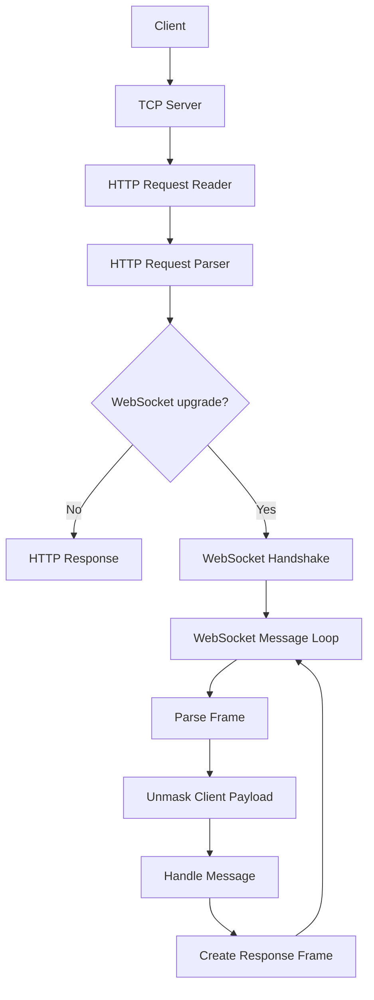
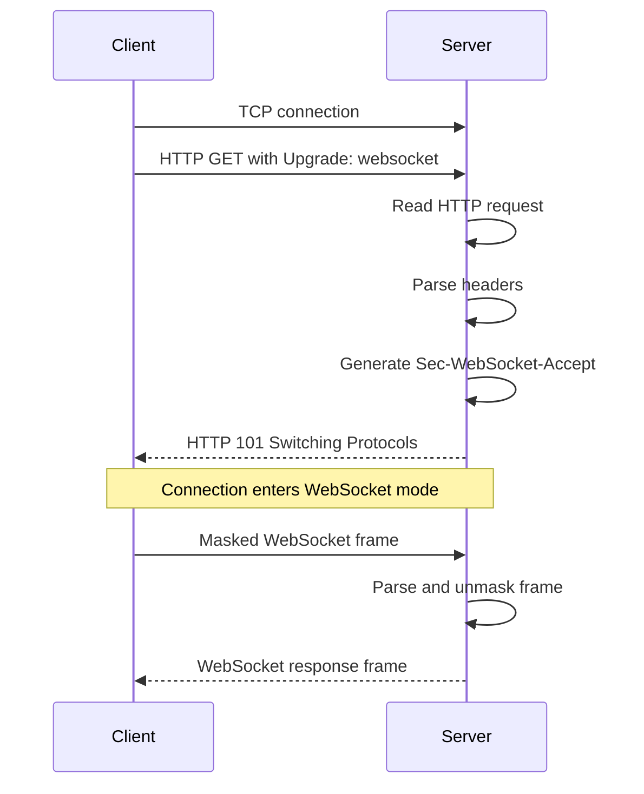

# C HTTP/WebSocket Server

A small HTTP and WebSocket server written in C using POSIX sockets.

The project implements HTTP request parsing, the WebSocket opening handshake, WebSocket frame handling, and a custom arena allocator. It is intended as a systems programming project for exploring network protocols and memory management at a lower level.

## Features

- TCP server built with POSIX sockets
- HTTP request reading and header parsing
- HTTP to WebSocket upgrade handshake
- WebSocket text frame parsing and framing
- Client frame unmasking
- SIMD-assisted WebSocket payload unmasking
- Arena-based request memory allocation
- Modular source and header organization

## Architecture



The server accepts a TCP connection and reads the incoming request as HTTP. After parsing the request headers, it either handles the request as HTTP or upgrades the connection to WebSocket mode.

## Project Structure

```text
.
├── include/
│   ├── arena.h
│   ├── http_request.h
│   ├── parse_http.h
│   ├── read_http.h
│   ├── server.h
│   ├── utils.h
│   ├── ws.h
│   └── ws_message.h
├── src/
│   ├── arena.c
│   ├── http_request.c
│   ├── main.c
│   ├── parse_http.c
│   ├── read_http.c
│   ├── server.c
│   ├── utils.c
│   ├── ws.c
│   └── ws_message.c
├── .gitignore
├── makefile
└── README.md
```

## Requirements

The project targets a Linux/POSIX environment.

Required tools:

- GCC
- GNU Make
- `sha1sum`
- `base64`

Optional tools for testing:

- `curl`
- `nc`

## Build

Clone the repository and build the server:

```bash
git clone git@github.com:Phenag/c_http_server.git
cd c_http_server
make
```

To remove generated object files and the server binary:

```bash
make clean
```

## Run

Start the server with:

```bash
./server
```

The server listens on port `8080`.

## HTTP Example

Send an HTTP request with `curl`:

```bash
curl http://localhost:8080/test
```

The current HTTP path returns the received request data in the response.

## WebSocket Upgrade

A WebSocket connection begins as an HTTP request containing upgrade headers.



The upgrade handler reads the `Sec-WebSocket-Key` header, appends the WebSocket GUID defined by RFC 6455, computes the SHA-1 digest, and Base64-encodes the result.

The generated value is returned in the `Sec-WebSocket-Accept` header with an HTTP `101 Switching Protocols` response.

A handshake can be inspected manually with:

```bash
(
  printf "GET /chat HTTP/1.1\r\n"
  printf "Host: localhost:8080\r\n"
  printf "Upgrade: websocket\r\n"
  printf "Connection: Upgrade\r\n"
  printf "Sec-WebSocket-Key: dGhlIHNhbXBsZSBub25jZQ==\r\n"
  printf "Sec-WebSocket-Version: 13\r\n"
  printf "\r\n"
  sleep 1
) | nc localhost 8080
```

A successful upgrade returns an HTTP `101 Switching Protocols` response.

## WebSocket Frame Handling

After the upgrade, the connection enters the WebSocket message loop.

Client frames are parsed to extract frame metadata, the masking key, and payload data. Client-to-server WebSocket frames are masked, so the server unmasks the payload before processing it.

The frame unmasking implementation includes an SSE-based path for processing payload bytes in larger chunks.

Response messages are encoded into WebSocket frames before being written to the socket.

## Arena Allocator

The project includes a small arena allocator backed by `mmap()`.

An arena reserves a contiguous memory region and serves allocations by advancing an offset through that region. Request-related allocations can then be discarded together by resetting the arena offset.

The allocator exposes operations for initialization, allocation, reset, and destruction.

## Current Limitations

- Single-threaded, blocking server
- HTTP request bodies are not parsed
- Fixed request and header limits
- No TLS support
- WebSocket protocol handling is incomplete
- WebSocket ping/pong handling is not implemented
- Graceful WebSocket shutdown is limited
- WebSocket handshake key generation depends on external `sha1sum` and `base64` commands

## Protocol References

- [RFC 6455 — The WebSocket Protocol](https://datatracker.ietf.org/doc/html/rfc6455)
- [RFC 9112 — HTTP/1.1](https://datatracker.ietf.org/doc/html/rfc9112)
